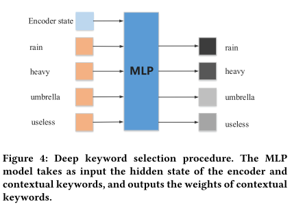

# Chatbot with knowledge 总结

[TOC]

## MemNet

> Knowledge-Grounded Neural Conversation Model

该模型思路如图：首先我们有一个可用的world facts，这是一个每行为一条词目的集合（例如百科，评论），并以命名实体作为关键词进行索引。然后在给定的source sequence S中，识别S的“focus”（即特征词）。这些foucs可以被用于关键词匹配或更先进的方法中，例如实体链（entity linking）或命名实体识别。这样query就可以检索到所有上下文相关的facts： F = {f1, f2, f3, ….., fk}。根据检索出的facts，encoder聊天记录，并利用其结果encoder相关知识，两部分encoder的结果结合，最终decoder出response。此处的encoder和decoder都是基于seq2seq模型。

### Facts Encoder:

$$
m_i = Ar_i\\
c_i=Cr_i\\
p_i = softmax(u^Tm_i)\\
o=\sum_{i=1}^kp_ic_i\\
\hat{u} = o+u
$$

$r_i$ 是代表 fi 的词袋表示（v维）；u 是聊天信息encoder出的结果（d维）.

## CopyNet

> Flexible End-to-End Dialogue System for Knowledge Grounded Conversation

GenDS由三部分组成：

1. Candidate Facts Retriever：从input中提取entity（E），然后在KB中进行query，将通过relation寻找到的objects和subjects作为Candidate Facts存储为一个集合。
2. Message Encoder：常见的Seq2Seq的Encoder部分，将input转换为一个representation H
3. Reply Decoder：在该Decoder中是根据H和candidate facts生成response。此处设计了一个门z knowledge_gate={0,1} 来控制该生成的是knowledge word还是common word.

## CCM
> Knowledge Aware Conversation Generation with Reasoning on Augmented Graph

### Seq2seq

**Encoder**: 

$$
h_t=GRU(h_{t-1}, e(x_t))
$$

**Decoder**: 
$$
s_t = GRU(s_{t-1}, [c_{t-1}, e(y_{t-1})] \\
c_{t-1}=\sum_{k=1}^n \alpha_k^{t-1} h_k \\
y_t \sim o_t = P(y_t|y_{<t}, c_t) = softmax(W_os_t)
$$

$\alpha_k^{t-1}$ 估量了状态 $s_{t-1}$ 和隐藏状态 $h_k$ 之间的相关度.

### Task Definition

a knowledge triple is represented by $k=(h,r,t)=MLP(TransE(h,r,t))$

### Knowledge Interpreter

$$
g_i = \sum_{n=1}^{N_{g_i}} \alpha_n^s [h_n;t_n]\\
\alpha_n^s = \frac{ exp(\beta_n^s)} {\sum_{j=1}^{N_{g_i}} exp(\beta_j^s)} \\
\beta_n^s = (W_rr_n)^T tanh(W_hh_n + W_tt_n) \\
e(x_t) = [w(x_t);g_i]
$$

$\alpha_n^s$ 估量了 $r_n$ 和 $h_n$ 与 $t_n$ 的相关度.

### Knowledge Aware Generator

$$
s_{t+1} = GRU(s_t, [c_t;c_t^g;c_t^k;e(y_t)]) \\
e(y_t)=[w(y_t);k_j]
$$
$k_j$ 是前一个单词 $y_t$ 选择的知识三元组.

$$
c_t^g =\sum_{i=1}^{N_G}\alpha_{ti}^g g_i \\
\alpha_{ti}^g = \frac{ exp(\beta_{ti}^g)} {\sum_{j=1}^{N_G} exp(\beta_{tj}^g)} \\
\beta_{tj}^g = V_b^T tanh(W_bs_t + U_bg_i)
$$

接下来计算选择某个三元组来生成答案的概率：

$$
c_t^k =\sum_{i=1}^{N_G}\sum_{j=1}^{N_{g_i}}\alpha_{ti}^g \alpha_{tj}^k k_j \\
\alpha_{tj}^k = \frac{ exp(\beta_{tj}^k)} {\sum_{n=1}^{N_{g_i}} exp(\beta_{tn}^k)} \\
\beta_{tj}^k = k_j^T W_c s_t
$$
最后，知识感知生成器选取通用词汇或实体词汇，基于如下概率分布：

$$
a_t = [s_t;c_t;c_t^g;c_t^k]\\
\gamma_t = sigmoid(V_o^T a_t)\\
P_c(y_t=w_c) = softmax(W_oa_t)\\
P_e(y_t=w_e) = \alpha_{ti}^g \alpha_{tj}^k \\
y_t \sim o_t = P(y_t) = [(1-\gamma_t)P_c(y_t=w_c), \gamma_t P_e(y_t=w_e)]
$$

## DSTC7

> Cluster-based Beam Search for Pointer-Generator Chatbot Grounded by Knowledge

### Fact Retrieval

选取与对话最相关的前topk个事实：
$$
sim(H,F)=\sum_\limits{w\in H} idf(w) \times count(w\ in\ F)
$$

### Encoder

$$
H^H=(h_1^H,h_2^H,...,h_L^H)\\
H^F=(h_1^F,h_2^F,...,h_T^F)
$$

### Decoder

Decoder主要包含三个模块：

1. 分别针对于对话历史和背景事实的注意力机制

2. 生成回复的模式预测

3. 词生成

#### Attention Mechanism

$$
e_{ti}^H = v_H^T tanh(W_h^H h_i^H + W_r^Hh_t^R+b^H)\\
\alpha_{ti}^H = Softmax(e_{ti}^H) \\
h_t^{H*} =\sum_{i=1}^L\alpha_{ti}^H h_i^H \\
$$

$$
e_{tj}^F = v_H^F tanh(W_h^F h_j^F + W_r^Fh_t^R+b^F)\\
\alpha_{tj}^F = Softmax(e_{tj}^F) 
\\h_t^{F*} =\sum_{j=1}^T\alpha_{tj}^F h_j^F \\
$$

#### Mode Prediction

Mode Prediction支持以下三种模式：

1. Seq2Seq生成一个词
2. 从对话历史中复制一个词
3. 从背景事实中复制一个词

模型使用一个softmax得到每个模式的概率：
$$
Pr(mode=m|t,H,F)=Softmax(FF(h_t^{F*}\otimes h_t^{H*}\otimes h_t^R\otimes x_t))
$$

#### Word prediction

最终，模型生成一个词的概率等于三种模式生成的概率相加：
$$
Pr(w|t,H,F) = \sum_{m=1}^3 Pr(m|t,H,F) Pr_m(w|t,H,F)
$$

1. 对于 Seq2Seq生成一个词：$Pr_m(w|t,H,F)=softmax(W_g h_t^R)$
2. 对于从对话历史或者背景事实中复制一个词： $Pr_m(w|t,H,F)=\alpha_{ti}^Hor\alpha_{ti}^F$

#### Cluster-based Beam Search

1. 首先根据对数似然概率选取前BS*2个候选项
2. 然后使用K-means聚成K个簇，聚类的特征为已解码序列的词向量平均
3. 在每一个簇中选取前BS/K个候选项作为下一步解码的候选集

## DAWnet

>Chat More: Deepening and Widening the Chatting Topic via A Deep Model

DAWnet 的目标是加深和拓宽聊天话题来提高回复的质量。更具体而言，全局通道首先会将给定上下文 (context) 转换成一个嵌入向量，其中编码了完整的历史信息。然后 DAWnet 会从句子中抽取出关键词，在收集到的关键词和上下文嵌入向量的基础上，宽度通道依赖一个基于注意力机制的循环神经网络（RNN）模型来预测相关话题的关键词。值得注意的是，这些关键词可能并没有出现在给定上下文中。深度通道则是通过训练一个多层感知机（MLP）模型来从上下文选择一些关键词进行话题的深入，其输入是上下文嵌入向量和收集到的关键词。我们的整个方案最后会将上下文编码器的输出、宽度通道中预测的关键词、深度通道中选择的关键词输入一个基于注意力机制的选择器，帮助解码器生成有意义的答复。

### Global Channel

$$
\mathcal{C}=\{w_1...w_t,...,w_T\}\\
h_t = f(h_{t-1}, e_{w_t})
$$

### Wide Channel

$$
s_t=f(s_{t-1},[e_{k_{t-1}^p}, c_t])\\
m_i = W_t e_{k_{i}^c} \\
c_t = \sum_{i=1}^T \alpha_{ti} h_i + \sum_{i=T+1}^{T+M} \alpha_{ti}m_i
$$
$e_{k_{t-1}^p}$ is the embedding vector of the keyword at time t-1 in the sequence of the **predicted** keywords.

$e_{k_i^c}$ is the embedding vector of the i-th **contextual** keyword.

### Deep Channel

$$
l_0=[h_T,e_{k_1^c},e_{k_2^c},...,e_{k_M^c}]\\
q=MLP(l_0)\\
m_i = q_i W_t e_{k_i}^c
$$

### Decoder

$$
n_i = W_t e_{k_i}^p \\
c_t = \sum_{i=1}^T \alpha_{ti} h_i + \sum_{i=T+1}^{T+M} \alpha_{ti}m_i + \sum_{i=T+M+1}^{T+M+N} \alpha_{ti}n_i
$$

## PostKS
> "Learning to Select Knowledge for Response Generation in Dialog Systems". arXiv(2019) 

## Others

