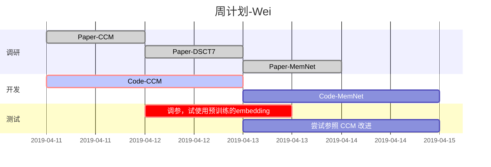
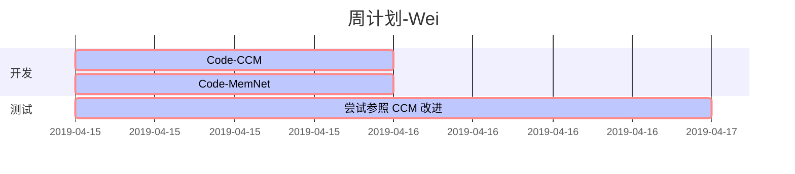

```mermaid
        gantt
        dateFormat  YYYY-MM-DD
        title 周计划-Wei

        section 调研
        Paper-CCM                      :done, paper1, 2019-04-11,1d
        Paper-DSCT7                    :done, paper2, after paper1, 1d
        Paper-MemNet                   :done, paper3, after paper2, 1d
        
        section 开发
        Code-CCM                      :crit, active, 2019-04-11,2d
        Code-MemNet                   :after paper2, 2d
    
        section 测试
        调参，试使用预训练的embedding       :crit, after paper1, 36h
        尝试参照 CCM 改进                   :after paper2, 2d
```

```mermaid
        gantt
        dateFormat  YYYY-MM-DD
        title 周计划-Wei
        
        section 开发
        Code-CCM                      :crit, active,2019-04-15, 1d
        Code-MemNet                   :crit, active,2019-04-15, 1d
    
        section 测试
        尝试参照 CCM 改进                   :crit, active,2019-04-15, 2d
```

