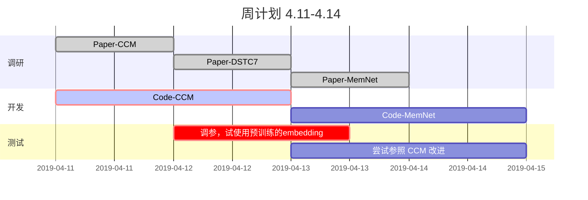
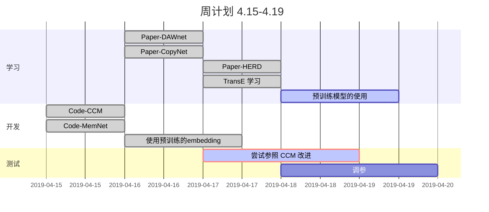
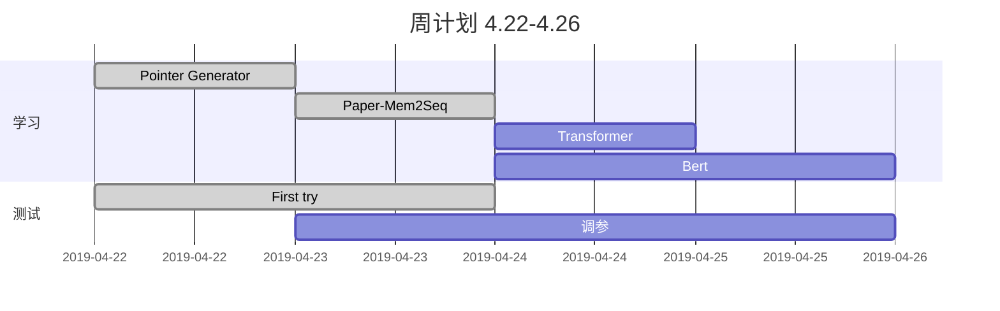
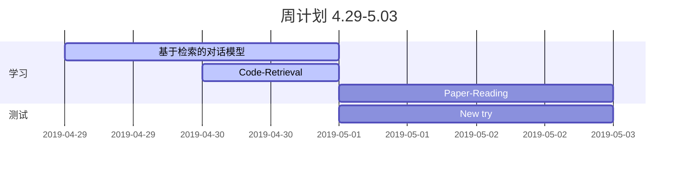

```mermaid
        gantt
        dateFormat  YYYY-MM-DD
        title 周计划 4.11-4.14

        section 调研
        Paper-CCM                      :done, paper1, 2019-04-11,1d
        Paper-DSTC7                    :done, paper2, after paper1, 1d
        Paper-MemNet                   :done, paper3, after paper2, 1d
        
        section 开发
        Code-CCM                      :crit, active, 2019-04-11,2d
        Code-MemNet                   :after paper2, 2d
    
        section 测试
        调参，试使用预训练的embedding       :crit, after paper1, 36h
        尝试参照 CCM 改进                   :after paper2, 2d
```

```mermaid
       gantt
        dateFormat  YYYY-MM-DD
        title 周计划 4.15-4.19
        
        section 学习
        Paper-DAWnet      :done, 2019-04-16, 1d
        Paper-CopyNet     :done,  2019-04-16, 1d
        Paper-HERD     :done,  2019-04-17, 1d
        TransE 学习          :done, study1, 2019-04-17, 1d
        预训练模型的使用          :active, after study1, 36h
        
        section 开发
        Code-CCM                      :done,2019-04-15, 1d
        Code-MemNet                   :done,2019-04-15, 1d
        使用预训练的embedding       :done,2019-04-16, 36h
    
        section 测试
        尝试参照 CCM 改进                   :crit, active, task1, 2019-04-17, 2d
        调参                        :task2, 2019-04-18, 2d
```

```mermaid
        gantt
        dateFormat  YYYY-MM-DD
        title 周计划 4.22-4.26
        
        section 学习
        Pointer Generator      :done, s1, 2019-04-22, 1d
        Paper-Mem2Seq            :done, s2, after s1, 1d
        Transformer     :s3, after s2,  1d
        Bert         :s4, after s2, 2d
        
        
        section 测试
        First try    :done, t1, 2019-04-22, 2d
        调参                 :t2, after s1, 3d
        
```

```mermaid
        gantt
        dateFormat  YYYY-MM-DD
        title 周计划 4.29-5.03
        
        section 学习
        基于检索的对话模型      :active, s1, 2019-04-29, 2d
        Code-Retrieval            :active, s2, 2019-04-30, 1d
        Paper-Reading            :2019-05-01, 2d
        
        
        section 测试
        New try         :t1, 2019-05-01, 2d
```

