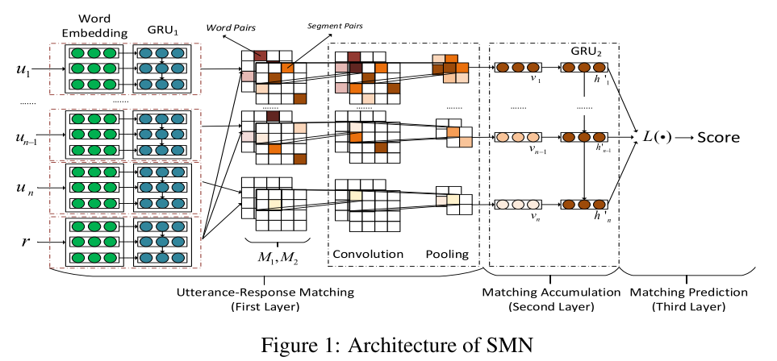
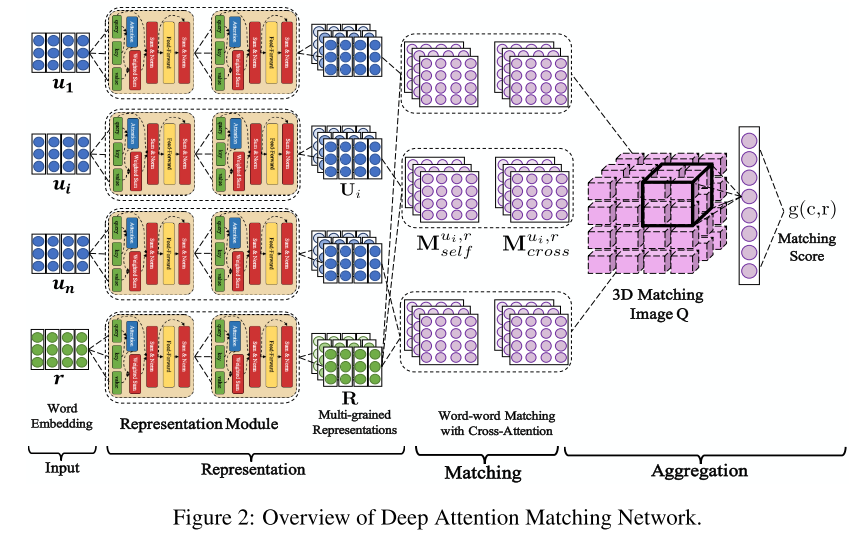

# Retrieval-based Dialogue 总结

[TOC]

## SMN

> "Sequential Matching Network: A New Architecture for Multi-turn Response Selection in Retrieval-Based Chatbots". ACL(2017)

## DAM

> "Multi-Turn Response Selection for Chatbots with Deep Attention Matching Network." Baidu. 

