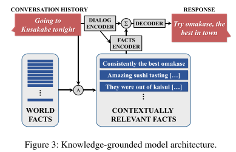

## Chatbot with knowledge 总结

### A Knowledge-Grounded Neural Conversation Model

该模型思路如图：首先我们有一个可用的world facts，这是一个每行为一条词目的集合（例如百科，评论），并以命名实体作为关键词进行索引。然后在给定的source sequence S中，识别S的“focus”（即特征词）。这些foucs可以被用于关键词匹配或更先进的方法中，例如实体链（entity linking）或命名实体识别。这样query就可以检索到所有上下文相关的facts： F = {f1, f2, f3, ….., fk}。根据检索出的facts，encoder聊天记录，并利用其结果encoder相关知识，两部分encoder的结果结合，最终decoder出response。此处的encoder和decoder都是基于seq2seq模型。

#### Facts Encoder:

$$
m_i = Ar_i\\
c_i=Cr_i\\
p_i = softmax(u^Tm_i)\\
o=\sum_{i=1}^kp_ic_i\\
\hat{u} = o+u
$$

$r_i​$ 是代表 fi 的词袋表示（v维）；u 是聊天信息encoder出的结果（d维）.