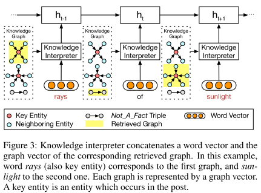
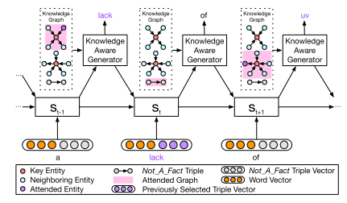

# Chatbot with knowledge 总结

[TOC]

## MemNet

> Knowledge-Grounded Neural Conversation Model

该模型思路如图：首先我们有一个可用的world facts，这是一个每行为一条词目的集合（例如百科，评论），并以命名实体作为关键词进行索引。然后在给定的source sequence S中，识别S的“focus”（即特征词）。这些foucs可以被用于关键词匹配或更先进的方法中，例如实体链（entity linking）或命名实体识别。这样query就可以检索到所有上下文相关的facts： F = {f1, f2, f3, ….., fk}。根据检索出的facts，encoder聊天记录，并利用其结果encoder相关知识，两部分encoder的结果结合，最终decoder出response。此处的encoder和decoder都是基于seq2seq模型。

### Facts Encoder:

$$
m_i = Ar_i\\
c_i=Cr_i\\
p_i = softmax(u^Tm_i)\\
o=\sum_{i=1}^kp_ic_i\\
\hat{u} = o+u
$$

$r_i​$ 是代表 fi 的词袋表示（v维）；u 是聊天信息encoder出的结果（d维）.

## CCM
> Knowledge Aware Conversation Generation with Reasoning on Augmented Graph

### Seq2seq

**Encoder**: 

$$
h_t=GRU(h_{t-1}, e(x_t))
$$

**Decoder**: 
$$
s_t = GRU(s_{t-1}, [c_{t-1}, e(y_{t-1})] \\
c_{t-1}=\sum_{k=1}^n \alpha_k^{t-1} h_k \\
y_t \sim o_t = P(y_t|y_{<t}, c_t) = softmax(W_os_t)
$$

$\alpha_k^{t-1}$ 估量了状态 $s_{t-1}$ 和隐藏状态 $h_k$ 之间的相关度.

### Task Definition

a knowledge triple is represented by $k=(h,r,t)=MLP(TransE(h,r,t))$

### Knowledge Interpreter

$$
g_i = \sum_{n=1}^{N_{g_i}} \alpha_n^s [h_n;t_n]\\
\alpha_n^s = \frac{ exp(\beta_n^s)} {\sum_{j=1}^{N_{g_i}} exp(\beta_j^s)} \\
\beta_n^s = (W_rr_n)^T tanh(W_hh_n + W_tt_n) \\
e(x_t) = [w(x_t);g_i]
$$

$\alpha_n^s$ 估量了 $r_n$ 和 $h_n$ 与 $t_n$ 的相关度.

### Knowledge Aware Generator

$$
s_{t+1} = GRU(s_t, [c_t;c_t^g;c_t^k;e(y_t)]) \\
e(y_t)=[w(y_t);k_j]
$$
$k_j$ 是前一个单词 $y_t$ 选择的知识三元组.

$$
c_t^g =\sum_{i=1}^{N_G}\alpha_{ti}^g g_i \\
\alpha_{ti}^g = \frac{ exp(\beta_{ti}^g)} {\sum_{j=1}^{N_G} exp(\beta_{tj}^g)} \\
\beta_{tj}^g = V_b^T tanh(W_bs_t + U_bg_i)
$$

接下来计算选择某个三元组来生成答案的概率：

$$
c_t^k =\sum_{i=1}^{N_G}\sum_{j=1}^{N_{g_i}}\alpha_{ti}^g \alpha_{tj}^k k_j \\
\alpha_{tj}^k = \frac{ exp(\beta_{tj}^k)} {\sum_{n=1}^{N_{g_i}} exp(\beta_{tn}^k)} \\
\beta_{tj}^k = k_j^T W_c s_t
$$
最后，知识感知生成器选取通用词汇或实体词汇，基于如下概率分布：

$$
a_t = [s_t;c_t;c_t^g;c_t^k]\\
\gamma_t = sigmoid(V_o^T a_t)\\
P_c(y_t=w_c) = softmax(W_oa_t)\\
P_e(y_t=w_e) = \alpha_{ti}^g \alpha_{tj}^k \\
y_t \sim o_t = P(y_t) = [(1-\gamma_t)P_c(y_t=w_c), \gamma_t P_e(y_t=w_e)]
$$

## DSTC7

> Cluster-based Beam Search for Pointer-Generator Chatbot Grounded by Knowledge

