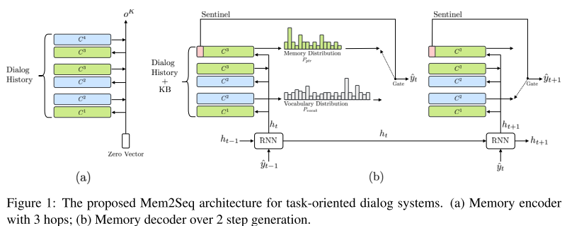

# Task-Oriented Dialogue 总结

[TOC]

## Mem2Seq

> "Mem2Seq: Effectively Incorporating Knowledge Bases into End-to-End Task-Oriented Dialog Systems". ACL(2018) 

## GLMP

> "Global-to-local Memory Pointer Networks for Task-Oriented Dialogue". ICLR(2019)

